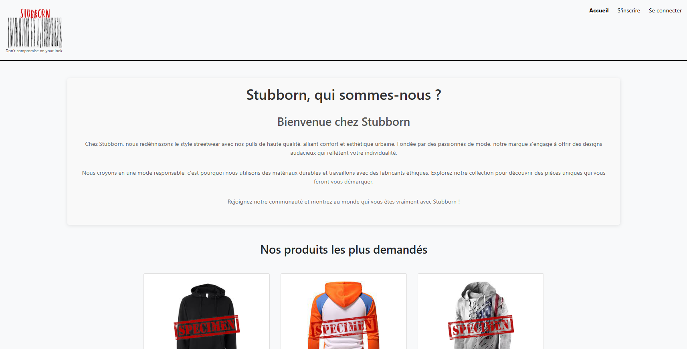

# REALISATION D'UN SITE DE E-COMMERCE AVEC SYMFONY

Bienvenue sur le site de Stubborn, site de E-Commerce :

        1   -   Création de compte utilisateur

        2   -   Un mode 'admin' qui permet d'avoir accès au menu de gestion qui permet l'ajout et la suppression de produit, ainsi que la gestion du stock

        3   -   Effectuer des achats tests dans un panier jusqu'au paiement (fictif pour le développement avec les informations contenue dans la
                documentation du projet au format PDF dans le repository)

-------------------------------------------------------------

## PREREQUIS 

1 - PHP 8.2 ou plus récent

2 - Composer pour la gestion des dépendances PHP

3 - MySQL pour la base de donnée

4 - Symfony CLI (facultatif, mais recommandé pour la gestion du projet)

-------------------------------------------------------------

### PROCEDURE DE LANCEMENT

1 - Installation du projet :

        git clone https://github.com/Tintin4522/stubborn

2 - Accéder au répertoire de développement :

        cd stubborn

3 - Installer toutes les dépendances :

        composer install

4 - Configurer les variables d'environnement comme mentionnées dans la documentation du projet

5 - Créer la base de donnée ou l'importer (Voir documentation PDF du projet)

-------------------------------------------------------------

#### DEMARRAGE DE L'APPLICATION EN LOCAL

Après avoir installé le projet, vous pouvez lancer l'application en excutant la commande suivante :

        symfony server:start

Une fois la commande lancer, rendez-vous dans votre navigateur à l'adresse suivante pour vous connecter avec les identifiants ci-dessous :

        http://localhost:8000/

-------------------------------------------------------------

##### CONNECTION AU SITE

Identifiants de connection une fois migrée la base de donnée "stubborn_bdd_backup" fourni dans le repository :

        En tant qu'administrateur du site :

                Nom d'utilisateur : admin
                Mot de passe : mdpadmin

        En tant qu'utilisateur du site : 
        
                Nom d'utilisateur : test
                Mot de passe : mdptest

-------------------------------------------------------------

###### CAPTURE D'ECRAN DU SITE

